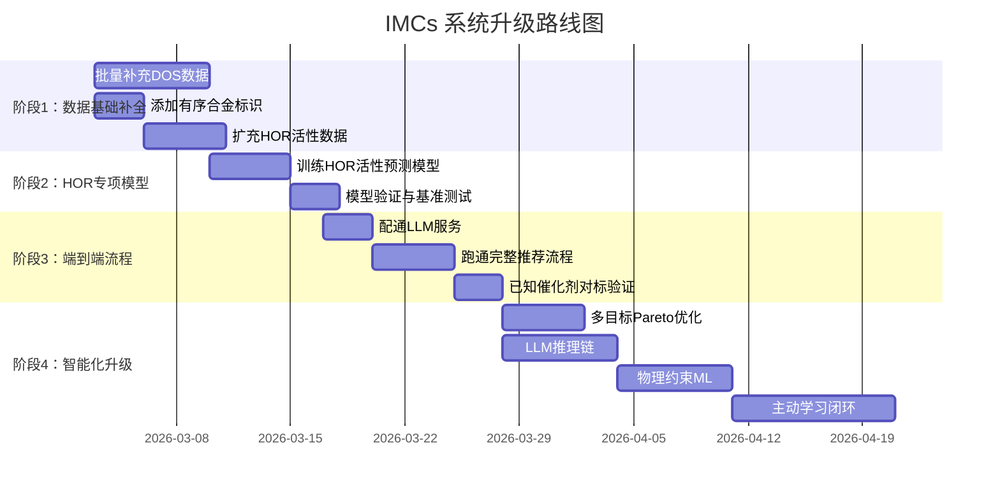

# IMCs 智能催化剂推荐系统 — 完整计划书

## 一、项目背景

**IMCs（Intelligent Materials Catalyst System）v4.0** 是一个基于多智能体协作的氢氧化反应（HOR）有序合金催化剂智能发现平台。系统采用 FastAPI + Streamlit + SQLite + PyTorch 技术栈，通过文献Agent、理论Agent、实验Agent、ML Agent和任务管理Agent五个智能体协同工作，实现从数据采集到催化剂推荐的全链路自动化。

**目标**：让系统真正能够**智能推荐HOR有序合金催化剂**，并逐步提升推荐的科学合理性和智能化水平。

---

## 二、系统现状评估

### 2.1 已实现能力

| 模块 | 核心能力 | 代码规模 |
|---|---|---|
| 5个核心Agent | 文献搜索、MP数据下载、LSV/RDE分析、ML训练/预测、任务规划 | ~93K行 |
| Orchestrator | 多Agent协调、能力评估、迭代执行、动态重规划 | 430行 |
| FusionEngine | 动态权重融合、d-band/形成能属性评分、可解释推荐 | 452行 |
| MetaController | 证据覆盖度自适应规划、HOR策略模板 | 504行 |
| PlanExecutor | DAG任务执行、失败重规划、证据补缺 | 1380行 |
| KnowledgeService | 知识图谱三元组存储、证据链、材料评分 | 462行 |
| Streamlit UI | 7个导航页（首页/对话/分析/训练/文献/API/设置） | 3265行 |
| 数据库 | 17张表、8577材料、720活性指标、3236吸附能 | 8MB |

### 2.2 关键差距

| 问题 | 现状 | 影响 |
|---|---|---|
| DOS数据覆盖不足 | 仅20%有DOS | d-band center无法计算，ML特征不完整 |
| 无有序合金标识 | 缺少空间群字段 | 推荐结果无法区分有序/无序 |
| LLM服务未配通 | Ollama/Gemini配置冲突 | 任务规划和推荐流程无法执行 |
| HOR专用模型缺失 | 目标多为formation_energy | 无法直接预测HOR活性指标 |
| 推荐评分单一 | 仅加权求和 | 缺乏多目标平衡和深度推理 |

---

## 三、实施路线图

---

## 四、各阶段详细计划

### 阶段1：数据基础补全（第1-2周）

> **目标**：确保数据库中的材料数据完整且可用于ML训练

| 任务 | 具体操作 | 交付物 |
|---|---|---|
| 1.1 批量补充DOS | 对6898条缺DOS材料，分批调用`TheoryAgent.download_orbital_dos()` | DOS覆盖率 ≥ 60% |
| 1.2 添加有序合金标识 | 运行/完善`inject_space_group.py`，为每条材料添加`space_group`和`is_ordered`字段 | materials表新增两列 |
| 1.3 扩充HOR活性数据 | 用`harvest_hor_seed`从文献中批量收割HOR性能数据 | activity_metrics ≥ 1000条 |
| 1.4 数据验证 | 运行`deep_validate.py`、`validate_scientific_data.py` | 数据质量报告 |

**验收标准**：
- `materials`表中 ≥ 60% 记录有`dos_data`
- 所有记录有`space_group`字段  
- 可筛选出 ≥ 500 条有序合金（`is_ordered = True`）
- `activity_metrics`记录 ≥ 1000

---

### 阶段2：HOR专项模型训练（第3周）

> **目标**：训练能直接预测HOR活性指标的ML模型

| 任务 | 具体操作 | 交付物 |
|---|---|---|
| 2.1 特征工程 | 合并 formation_energy + d_band_center + dos_descriptors + adsorption_energy 作为特征 | 特征矩阵 |
| 2.2 训练活性模型 | 分别以 `exchange_current_density`、`overpotential_10mA`、`mass_activity` 为目标训练 RF/XGB/DNN | ≥ 3个模型 |
| 2.3 模型评估 | R²/MAE/RMSE 评估 + SHAP分析关键特征 | 评估报告+SHAP图 |
| 2.4 基准检验 | 验证模型能否正确排列已知催化剂（Pt₃Ni > Pt > Ni） | 排序合理性报告 |

**验收标准**：
- 至少一个目标的 R² > 0.5
- SHAP特征重要性排序中，d_band_center 和 delta_g_h 排名前5
- 已知高性能催化剂在模型预测中排名前列

---

### 阶段3：端到端流程打通（第4周）

> **目标**：系统能实际运行并输出有意义的催化剂推荐

| 任务 | 具体操作 | 交付物 |
|---|---|---|
| 3.1 配通LLM | 安装Ollama或统一Gemini API配置 | LLM推理可用 |
| 3.2 流程集成测试 | `start_imcs.bat` 启动 → 在UI输入"推荐碱性HOR有序合金催化剂" → 等待结果 | 完整推荐结果截图 |
| 3.3 有序合金过滤 | 在推荐链路中添加`is_ordered`过滤条件 | 仅推荐有序合金 |
| 3.4 对标验证 | 确认 Pt₃Ni、PtRu、Pt₃Co 等已知HOR催化剂出现在推荐前列 | 验证报告 |

**验收标准**：
- 系统可一键启动并在60秒内响应查询
- 推荐结果 Top-10 中 ≥ 3 个为已知高性能HOR有序合金
- 每个推荐附带可解释的推荐理由

---

### 阶段4：智能化升级（第5-8周）

> **目标**：从"能用"到"好用"，让推荐更科学、更智能

#### 4.1 多目标Pareto优化（第5周）

| 内容 | 说明 |
|---|---|
| 新建文件 | `src/services/ml/pareto.py` |
| 优化目标 | 活性（j₀）↑ + 稳定性（Ef）↓ + 成本↓ + 可合成性↑ |
| 集成点 | `fusion.py` → `_calculate_scores()` 用Pareto rank替代加权和 |
| UI展示 | Pareto前沿散点图 + 用户偏好滑块 |

#### 4.2 LLM推理链（第5-6周）

| 内容 | 说明 |
|---|---|
| 新建文件 | `src/agents/reasoning_chain.py` |
| 推理步骤 | 结构分析→电子结构→热力学→稳定性→文献验证→综合评估 |
| 集成点 | `orchestrator.py` 融合阶段后调用推理链 |
| 输出 | 每个Top-N候选材料附带结构化推理报告 |

#### 4.3 物理约束ML（第6-7周）

| 内容 | 说明 |
|---|---|
| 新建文件 | `src/services/ml/physics_loss.py` |
| 约束内容 | Sabatier火山型约束 + d-band线性关系 + BEP关系 |
| 集成点 | `trainer.py` → `train_dnn()` 替换损失函数 |

#### 4.4 主动学习闭环（第7-8周）

| 内容 | 说明 |
|---|---|
| 新建文件 | `src/services/ml/active_learning.py` |
| 核心机制 | 集成模型不确定性量化 → EI采集函数 → 实验建议 |
| 集成点 | `ml_agent.py` 新增 `suggest_experiments()` |
| UI展示 | "下一步实验建议"面板，含优先级排序和预期信息增益 |

---

## 五、预期成果

| 阶段 | 核心产出 |
|---|---|
| 阶段1完成后 | 数据完备的有序合金材料库 |
| 阶段2完成后 | 可预测j₀/过电位/质量活性的HOR ML模型 |
| 阶段3完成后 | **端到端可用的HOR有序合金催化剂推荐系统** |
| 阶段4完成后 | 具备多目标优化、LLM推理、物理约束、主动学习能力的**智能推荐系统** |

---

## 六、技术风险与应对

| 风险 | 概率 | 影响 | 应对 |
|---|---|---|---|
| MP API配额/限流 | 中 | DOS补全速度慢 | 分批下载+本地缓存+sleep策略 |
| HOR活性数据稀疏 | 高 | 模型R²低 | 迁移学习（从HER数据迁移）+ 数据增强 |
| LLM推理质量不稳定 | 中 | 推荐理由不准确 | 多模型投票 + 人工审核模板 |
| 物理约束与数据冲突 | 低 | 训练不收敛 | 约束权重退火策略 |
