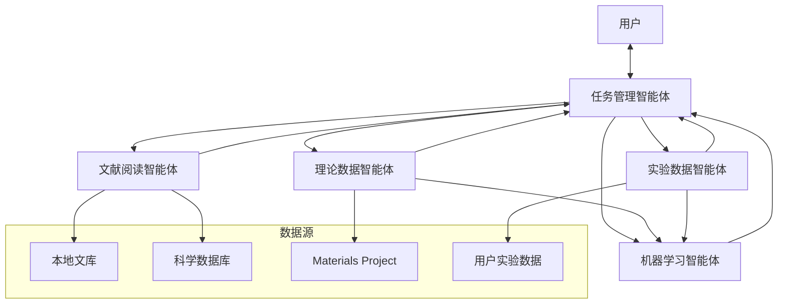
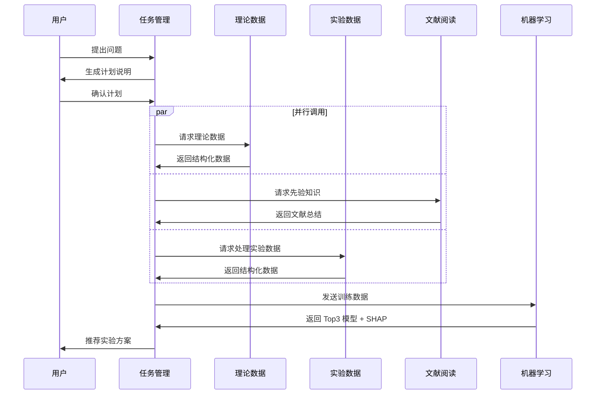

# 多智能体框架架构设计

## 系统概览



---

## 1. 任务管理智能体 (Task Management Agent)

### 职责
- 用户对话接口
- 生成并确认计划说明
- 协调调度其他 4 个智能体
- 整合信息并推荐实验

### 核心功能

| 功能 | 描述 |
| :--- | :--- |
| `create_plan()` | 根据用户需求生成计划说明 |
| `confirm_plan()` | 与用户确认计划 |
| `dispatch_agents()` | 调度相关智能体 |
| `aggregate_results()` | 整合各智能体反馈 |
| `recommend_experiments()` | 基于信息推荐实验 |

### 工作流程

```
1. 接收用户问题
2. 分析需求 → 生成计划说明
3. 用户确认计划
4. 调度智能体:
   - 需要理论数据 → 理论数据智能体
   - 需要实验数据 → 实验数据智能体
   - 需要先验知识 → 文献阅读智能体
   - 需要预测模型 → 机器学习智能体
5. 收集各智能体反馈
6. 整合分析 → 推荐实验
```

---

## 2. 机器学习智能体 (ML Agent)

### 职责
- 接收训练数据 (理论+实验)
- 训练多种 ML 模型
- SHAP 可解释性分析
- 返回最佳模型

### 三类模型

| 类型 | 模型 | 输入 | 特点 |
| :--- | :--- | :--- | :--- |
| **原子级 GNN** | CGCNN, SchNet, MEGNet | 原子坐标+拓扑 | 捕捉局部结构 |
| **传统 ML** | XGBoost, RF, GB, LightGBM | 特征向量 | SHAP 可解释 |
| **深度神经网络** | MLP, Transformer | 特征向量 | SHAP 可解释 |

### 核心功能

```python
class MLAgent:
    def train_gnn_models(data)          # 训练原子级模型
    def train_traditional_ml(data)      # 训练传统 ML
    def train_deep_learning(data)       # 训练深度网络
    def shap_analysis(model, data)      # SHAP 分析
    def get_top3_models()               # 返回最佳 3 个模型
    def predict(model, new_data)        # 预测新材料
```

### 输出
- Top 3 模型及性能指标
- SHAP 特征重要性
- 预测结果

---

## 3. 文献阅读智能体 (Literature Agent)

### 职责
- 检索本地文库和在线科学库
- 阅读和总结文献
- 提取先验知识

### 知识提取类型

| 类型 | 示例 |
| :--- | :--- |
| **表征方法** | XRD, XPS, TEM, EXAFS |
| **反应机理** | HER/HOR 机理, 活性位点 |
| **合成方法** | 电沉积, 热处理, 合金化 |
| **催化性能** | 过电位, Tafel 斜率 |
| **元素作用** | Pt 的 d-band 效应 |

### 数据源

| 来源 | 类型 |
| :--- | :--- |
| 本地文库 | PDF, 笔记 |
| Semantic Scholar | 学术论文 |
| Google Scholar | 学术论文 |
| arXiv | 预印本 |

### 输出格式
```json
{
  "topic": "PtRu 合金 HOR 催化剂",
  "key_findings": [...],
  "synthesis_methods": [...],
  "characterization": [...],
  "performance_metrics": {...},
  "references": [...]
}
```

---

## 4. 理论数据智能体 (Theory Data Agent)

### 职责
- 从材料数据库下载数据
- 数据结构化处理
- 向任务管理智能体确认下载内容

### 数据源

| 数据库 | 数据类型 |
| :--- | :--- |
| **Materials Project** | CIF, 形成能, DOS, band gap |
| **OQMD** | 形成能, 相图 |
| **AFLOW** | 弹性常数, 电子结构 |
| **Catalysis-Hub** | 吸附能, 反应能垒 |

### 可下载数据

- CIF 晶体结构
- 形成能 (Formation Energy)
- 电子态密度 (DOS)
- 能带结构 (Band Structure)
- 吸附能 (Adsorption Energy)
- 表面能 (Surface Energy)

### 核心功能

```python
class TheoryDataAgent:
    def list_available_data(query)      # 列出可下载数据
    def download_structures(ids)        # 下载 CIF
    def download_properties(ids, props) # 下载属性
    def process_and_structure(data)     # 结构化处理
    def extract_features(data)          # 特征提取
```

---

## 5. 实验数据智能体 (Experiment Data Agent)

### 职责
- 处理用户提供的电化学测试数据
- 数据结构化和特征提取
- 输出可用于 ML 的格式

### 支持的数据类型

| 测试 | 输出 |
| :--- | :--- |
| **LSV** | 过电位, 电流密度 |
| **CV** | ECSA, 电容 |
| **Tafel** | Tafel 斜率, 交换电流密度 |
| **EIS** | Rct, Rs, CPE |
| **Chronoamperometry** | 稳定性指标 |
| **RDE/RRDE** | 电子转移数, HO2- 产率 |

### 输入格式
- CSV/Excel 原始数据
- EC-Lab/CHI 电化学仪器文件

### 输出格式
```json
{
  "sample_id": "PtRu-001",
  "test_type": "LSV",
  "overpotential_10mA": 25,
  "current_density_max": 150,
  "tafel_slope": 35,
  ...
}
```

---

## 数据流架构



---

## 文件结构

```
IMCs/
├── src/
│   ├── agents/
│   │   ├── task_manager.py       # 任务管理智能体
│   │   ├── ml_agent.py           # 机器学习智能体 (已完成部分)
│   │   ├── literature_agent.py   # 文献阅读智能体
│   │   ├── theory_agent.py       # 理论数据智能体
│   │   └── experiment_agent.py   # 实验数据智能体
│   ├── models/
│   │   ├── gnn/                  # GNN 模型
│   │   ├── traditional_ml/       # 传统 ML
│   │   └── deep_learning/        # 深度学习
│   ├── data_processing/
│   │   ├── cif_processor.py      # CIF 处理
│   │   └── echem_processor.py    # 电化学数据处理
│   └── utils/
│       ├── shap_utils.py         # SHAP 分析工具
│       └── api_utils.py          # API 调用工具
└── data/
    ├── theory/                   # 理论数据
    ├── experimental/             # 实验数据
    ├── literature/               # 文献缓存
    └── ml_models/                # 训练好的模型
```

---

## 实现优先级

| 优先级 | 智能体 | 状态 | 备注 |
| :--- | :--- | :--- | :--- |
| **P0** | 机器学习智能体 | ✅ 部分完成 | ml_agent.py 已有 |
| **P1** | 理论数据智能体 | ⚠️ 部分完成 | fetch 脚本已有 |
| **P2** | 实验数据智能体 | 🔲 待开发 | 需要电化学处理 |
| **P3** | 文献阅读智能体 | 🔲 待开发 | 需要 API 集成 |
| **P4** | 任务管理智能体 | 🔲 待开发 | 需要协调逻辑 |

---

## 下一步

1. 完善机器学习智能体 (添加 GNN 和深度学习)
2. 整合理论数据智能体
3. 开发实验数据智能体 (电化学处理)
4. 开发文献阅读智能体 (API 集成)
5. 开发任务管理智能体 (协调逻辑)
